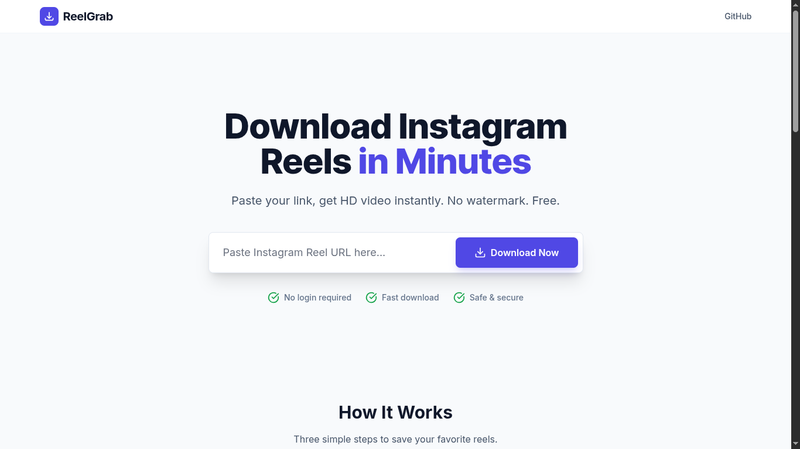

# 🎬 ReelGrab

Download Instagram Reels in minutes — fast, free, and without watermark.



---

## 🚀 Features

- ⚡ **Fast Processing**  
  High-speed video extraction using optimized servers.

- 🎥 **HD Quality**  
  Download reels in the highest available resolution.

- 🔒 **Privacy First**  
  No tracking, no data storage — your downloads stay yours.

- 📱 **Works Everywhere**  
  Fully responsive on mobile, tablet, and desktop.

- ✅ **No Login Required**  
  Start downloading instantly without creating an account.

---

## 🧠 How It Works

1. **Copy Link**  
   Open Instagram and copy the Reel URL.

2. **Paste Link**  
   Paste the URL into the input field on the homepage.

3. **Download**  
   Click the **Download Now** button and save your video.

---

## 🖥️ Tech Stack

- **Frontend:** React + TypeScript
- **Styling:** TailwindCSS + DaisyUI
- **Backend:** (Your stack — e.g. Hono / Node.js)
- **Deployment:** Vercel

---

## 📦 Installation

```bash
git clone https://github.com/brijeshdevio/reel-grap.git
cd reel-grab/client
pnpm install
pnpm dev

cd reel-grab/server
pnpm install
pnpm start
```

---

## 🌐 Usage

1. Open the app in your browser
2. Paste an Instagram Reel link
3. Click **Download Now**
4. Save the video instantly 🎉

---

## ❓ FAQ

### Is it free to use?

Yes, ReelGrab is completely free.

### Do I need to login?

No, you can download reels without logging in.

### Is it safe?

Yes, we do not store your data or track downloads.

---

## 🤝 Contributing

Contributions are welcome! Feel free to open issues or submit pull requests.

---

## 📄 License

This project is licensed under the MIT License.

---

## 🙌 Acknowledgements

Built with ❤️ by **Brijesh**

---

## ⭐ Support

If you like this project, give it a star ⭐ on GitHub!
